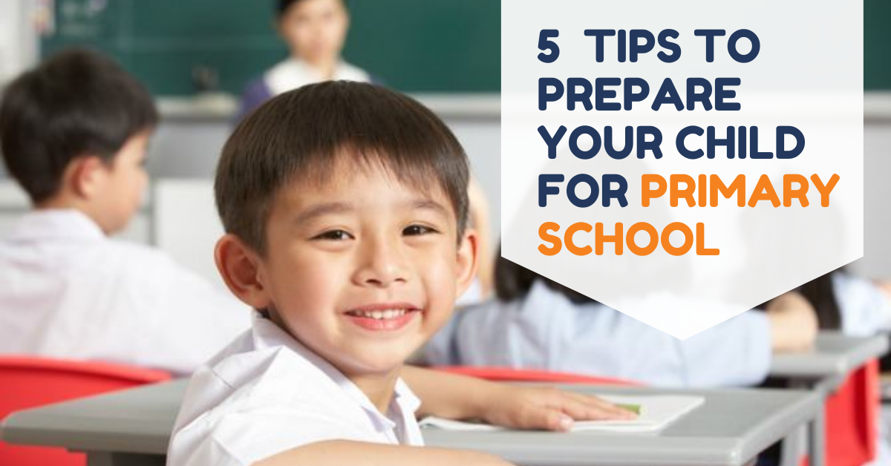

Transitioning from preschool to primary school in Singapore can be daunting. Anyone can be thrown off by new teachers, new friends, and new learning formats.

Here, we'll go through what big changes your child can expect and how you, as a parent, can help them be as prepared as they can be for Primary One.

## 1\. Talk about Making New Friends

Going to a new school typically entails bidding farewell to old friends and making new ones. It is important to talk to your child about how they can make new friends. Help ease their fears by assuring them that they would still be able to see their pre-school pals. Within the first two months of primary school, schedule some playdates with their pre-school peers so that your child can continue to maintain these friendships.

## 2\. Prepare them for buying food at the school canteen.

For some children, buying food from the canteen for the first time can be surprisingly nerve-wracking. By following these tips, you can help your child feel more self-assured and confident:

**Act it out:** Conduct a "role play" with your child where you can pretend to be the canteen aunty/uncle and have your child practice basic conversations and handling money. You may also reverse the roles to help them understand better. This will help them familiarise themselves with the interaction.

**Introduce the idea of saving:** Give your child a bit more than what the food costs to instill the habit of saving. They get to learn about money management at an early age, which is an important skill that will help them succeed later in life.

## 3\. Involve your child in their primary school supplies preparation.

Allow your child to participate in buying and labelling their school books and supplies. While at home, they may enjoy going through their textbooks, fresh notebooks and new art supplies! Take this opportunity to also talk to them on which items are for what subjects, just to pique their curiousity in what they will learn soon. As they participate in the process of labelling their materials, they will have a greater sense of ownership over their belongings.

## 4\. Teach Your Child about Safety

Go over all of the potential situations that your child might face at school that pose a threat to his or her safety. Discuss what to do if an adult or another kid makes them feel uneasy, as well as fire safety measures, the dangers of leaving the school premises unattended, and road safety issues.

## 5\. Get organised

Primary school kids bring home lots of papers. You and your child will both be responsible for keeping track of various notices, events, school paperwork, and assignments for various disciplines.

Here are two methods for staying organized:

**Keep a file for school-related papers:** This file should contain all the letters and forms that your child brings home from school. You can also have them place their completed homework in the file for your review.

**Have a daily homework planner:** In line with being organised, educate your child on how to stay organised with their homework as well. They should keep track of their assignments in a daily planner once school starts. This teaches them how to be responsible.

#### And finally, prepare to get emotional!

It is completely normal to shed a tear when your child starts school. It can be upsetting for parents to accept that their child is growing up and is able to cope without them for whole days at a time. As you wave them off, you may be overwhelmed with a range of emotions – pride, sadness, longing, apprehension, happiness, and even guilt. But you are not alone. Most other parents will feel the same way! Why not arrange to go out for coffee with other parents, or do something relaxing to help take your mind off it and pass the time until you can pick them up – remember, self-care is important for yourself too. Your little one will be overjoyed to see you again at the end of their first day!