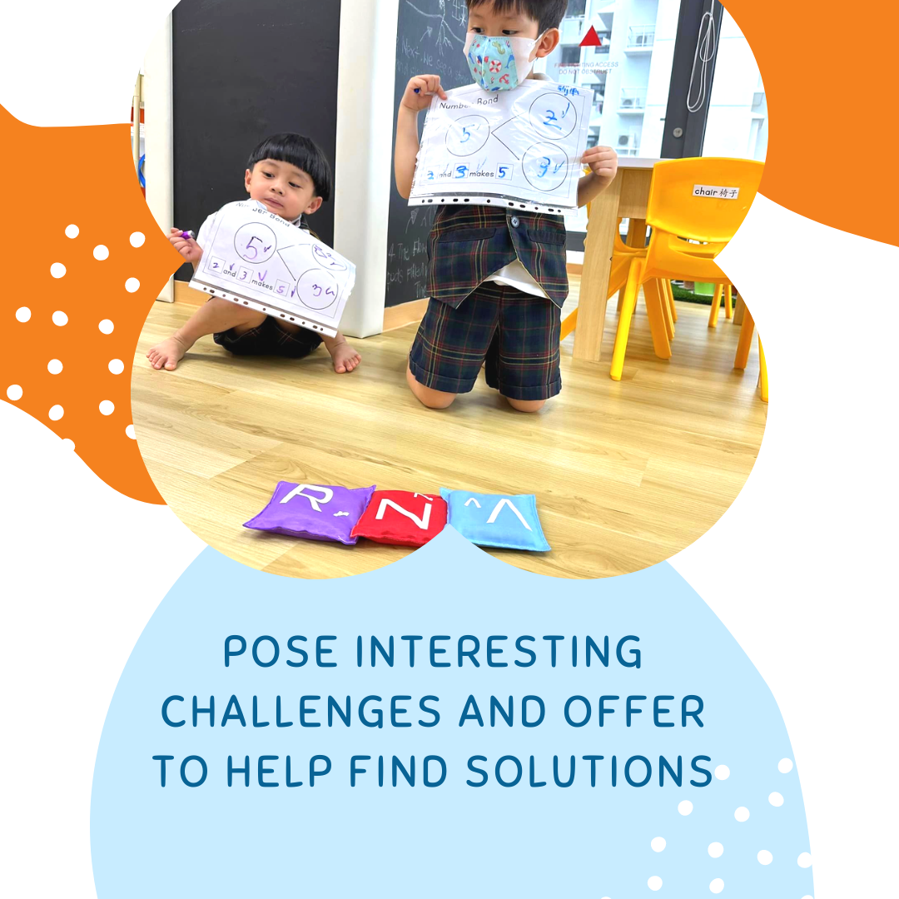
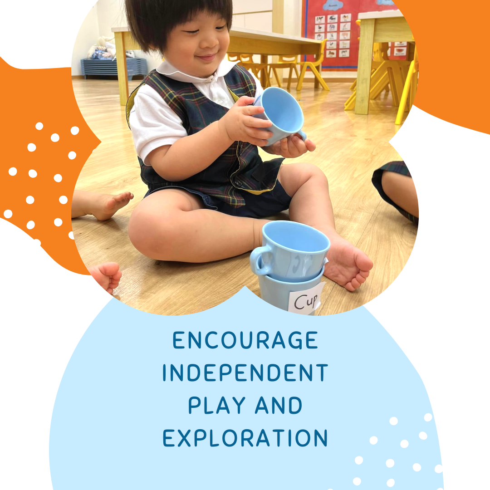
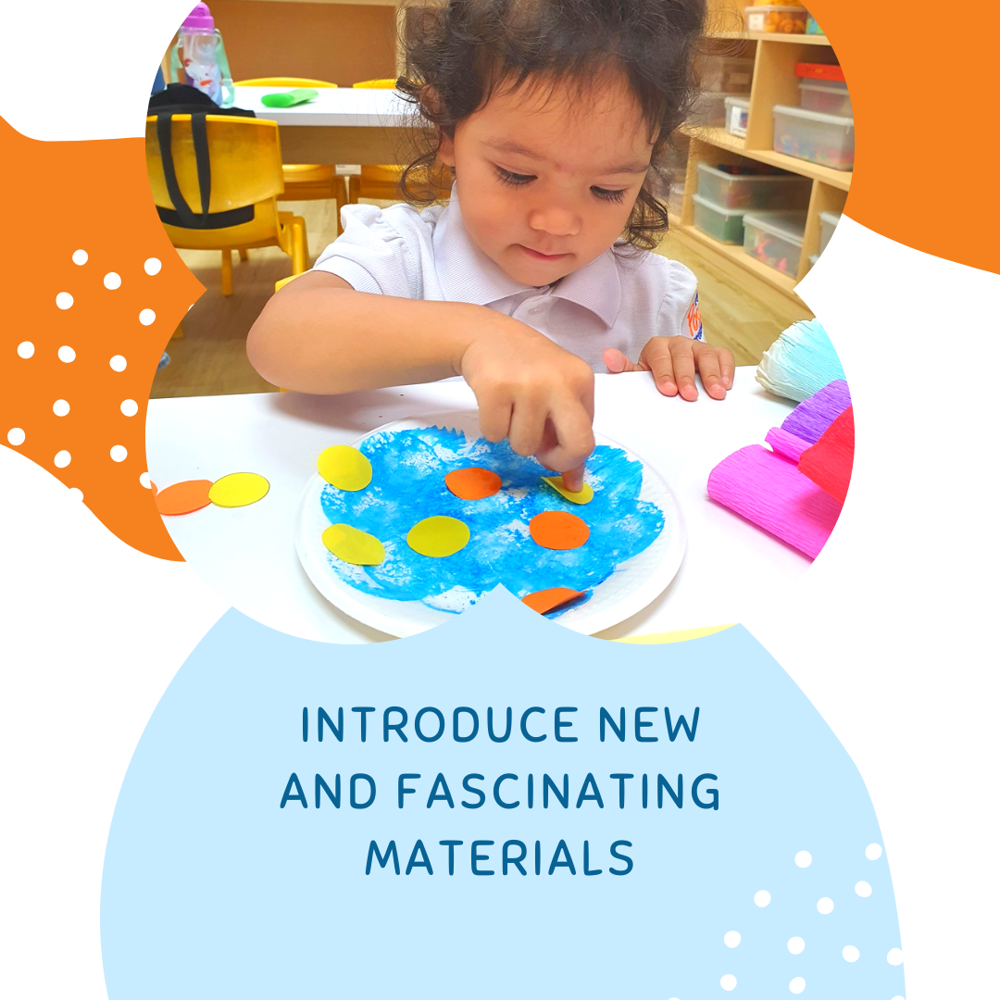

Providing open-ended questions and encouraging exploration can help children develop their critical thinking skills and begin to think outside the box. By being given the opportunity to explore and think freely, children can uncover their own unique ways of problem-solving and develop an inquisitive attitude towards learning. Open-ended questions also allow children to gain a better understanding of topics and ask for more information that helps them form their own ideas.

Posing interesting challenges and offering to help find solutions can help stimulate creativity and critical thinking in children. It can also help them develop problem-solving skills, as they learn to identify potential solutions and consider different options to reach them. Offering help in the form of guidance or advice can also provide the encouragement and support they need to take risks and explore their curiosity.

Encouraging independent play and exploration can help children build self-confidence and become comfortable taking risks. It can also give them the space to explore their curiosity and ask questions, as well as develop problem-solving and critical thinking skills. Furthermore, it offers the chance for them to discover new things on their own and create a sense of ownership with their learning.

Introducing new and fascinating materials can help create a sense of wonder and excitement in children. Exploring unfamiliar materials can help them engage with different textures, colors, shapes, and other sensations that can expand their knowledge. Additionally, it can give them the opportunity to ask questions and explore the environment with a sense of curiosity.

Reading books that have multiple levels of understanding can help encourage curiosity in children by giving them the opportunity to explore a variety of topics and interests. Books with multiple layers allow for deeper exploration, as they are able to progress from basic concepts to more complex topics. Additionally, these books may include illustrations or diagrams which can aid in promoting further inquiry.

Nurturing curiosity in children is essential for their development. Not only does it foster a fun and healthy parent-child bond, it also helps them become lifelong learners who are comfortable taking risks and exploring uncharted paths. Encouraging curiosity will help them to discover, learn and grow through exploration, critical thinking and problem-solving.