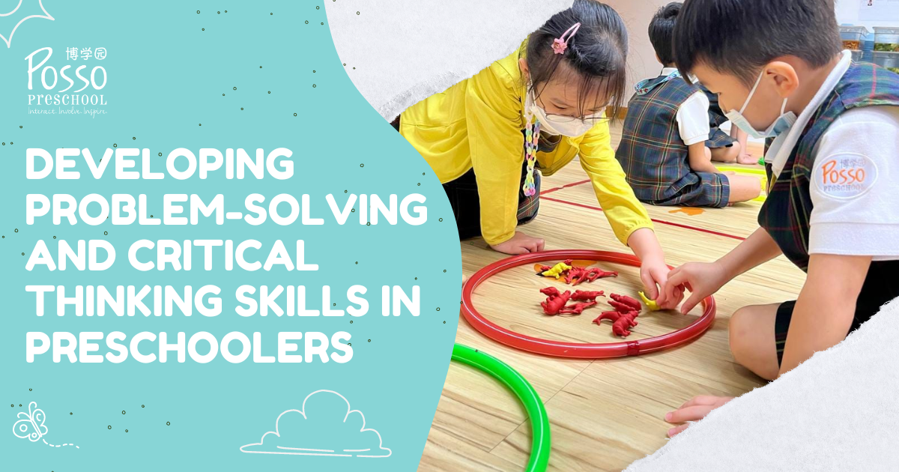

As parents and educators, we all want our children to be successful in life. We want them to be able to solve problems and think critically so they can make informed decisions. Developing these skills early on can set the foundation for a lifetime of success. In this blog post, we will discuss some tips for developing problem-solving and critical thinking skills in preschoolers.

**Encourage curiosity**

Preschoolers are naturally curious, and this curiosity can be harnessed to develop problem-solving and critical thinking skills. Encourage your child to ask questions and explore the world around them. When they ask a question, take the time to answer it in a way that encourages further exploration. For example, if your child asks why the sky is blue, you could explain that it's because of the way light scatters in the atmosphere, which could lead to a discussion about light and colors.

**Provide opportunities for exploration and experimentation**

Preschoolers learn best through hands-on experiences. Provide your child with opportunities to explore and experiment with different materials and objects. For example, you could set up a simple science experiment with water and different objects to see which ones float and which ones sink. Encourage your child to make predictions and test their ideas.

**Ask open-ended questions**

Asking open-ended questions can encourage preschoolers to think critically and creatively. Rather than asking yes or no questions, ask questions that require your child to think and reason. For example, instead of asking if your child likes a particular book, ask them what they liked about it or what they would change.

**Encourage problem-solving**

When your child encounters a problem, resist the urge to solve it for them. Instead, encourage them to come up with their own solutions. For example, if your child can't reach a toy on a high shelf, encourage them to think of ways they could reach it themselves. This can help them develop problem-solving skills and build confidence in their own abilities.

**Play games that encourage problem-solving and critical thinking**

Playing games that require problem-solving and critical thinking can be a fun way to develop these skills. Games like puzzles, board games, and memory games can all help preschoolers develop their cognitive abilities. Encourage your child to play with others and work together to solve problems.

In conclusion, developing problem-solving and critical thinking skills in preschoolers is important for their future success. By encouraging curiosity, providing opportunities for exploration and experimentation, asking open-ended questions, encouraging problem-solving, and playing games that require critical thinking, you can help your child develop these skills early on. With these skills, your child will be better equipped to face the challenges that come their way and make informed decisions throughout their lives.