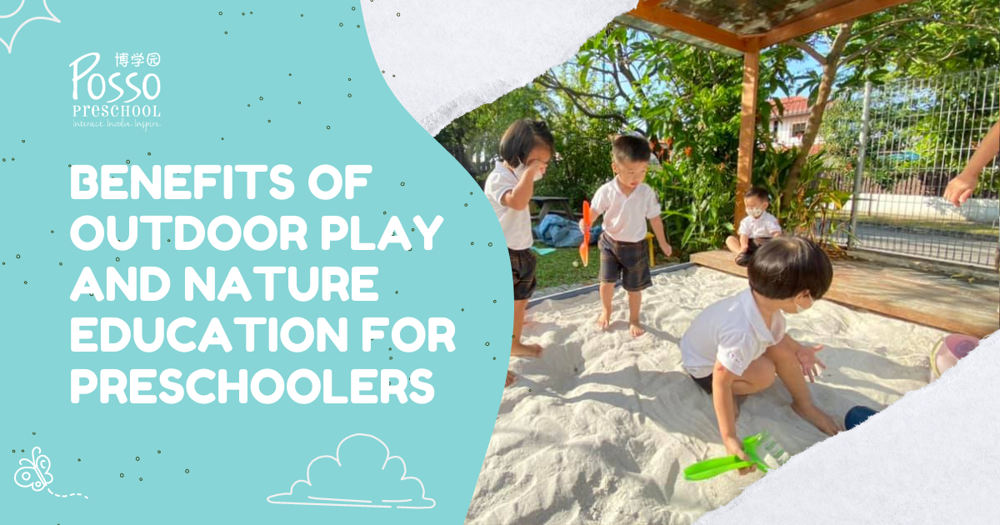

As a parent or caregiver of a preschooler, you may wonder about the importance of outdoor play and nature education. In recent years, research has shown that spending time outside and learning about the natural world can have a significant impact on a child's development. In this blog post, we will explore the benefits of outdoor play and nature education for preschoolers.

**Physical Development**

Outdoor play provides an opportunity for children to develop their gross motor skills, such as running, jumping, and climbing. These activities not only improve their physical abilities but also help them gain confidence in their bodies. Nature education also encourages physical development as children may engage in activities such as hiking, exploring, and gardening.

**Cognitive Development**

Nature education encourages curiosity, exploration, and problem-solving skills. When children are in natural settings, they are given opportunities to learn about the environment around them. They can observe and identify different types of plants and animals, learn about the weather, and gain an understanding of the importance of conservation. These experiences help develop critical thinking and decision-making skills.

**Emotional Development**

Outdoor play and nature education have been linked to improved emotional well-being in children. Spending time in natural settings can reduce stress and anxiety while promoting feelings of happiness and contentment. Nature education also encourages empathy and compassion as children learn about the interdependence of all living things.

**Social Development**

Playing outdoors with other children can help children to develop social skills such as cooperation, communication, and conflict resolution. Nature education programs also provide opportunities for children to work together on projects such as building a birdhouse or planting a garden. These collaborative activities help foster a sense of community and teamwork.

**Environmental Stewardship**

By learning about the natural world, children can develop a sense of responsibility for the environment. They may become more aware of the impact humans have on the planet and may be motivated to take action to protect it. Nature education programs often teach children about the importance of conservation and sustainability, helping to cultivate a generation of environmentally conscious individuals.

In conclusion, outdoor play and nature education offer numerous benefits for children. These experiences can enhance physical, cognitive, emotional, and social development while also promoting environmental stewardship. Parents and caregivers can encourage their children to explore the natural world by taking them on nature walks, visiting local parks, and enrolling them in nature education programs. By doing so, they can help foster a lifelong love of nature and a commitment to preserving it for future generations.