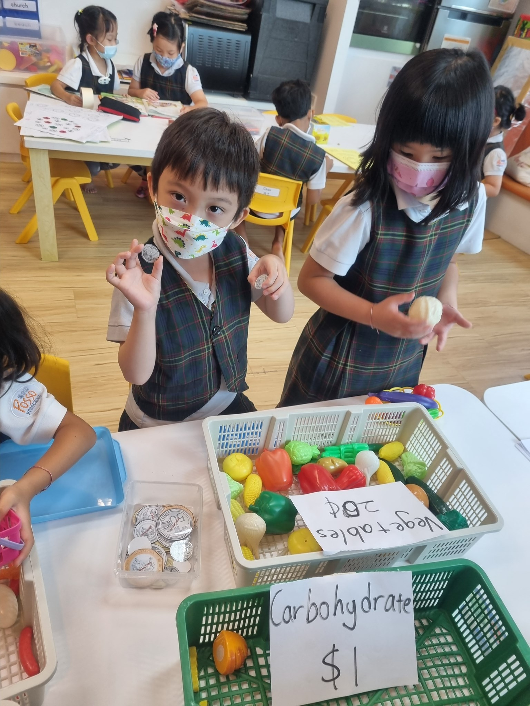

Bringing your children to shop for groceries can be beneficial if you make it fun! It encourages your child to ask good questions about food and items that they see in the supermarket. You can now use one of these activities that are not only fun but also educational. Who knew children can learn so much in a grocery store?

## Here are 10 preschool activities that you can do with your child at the grocery store:

### iSpy Grocery Store

When you don't have time to plan ahead, this is an easy method to keep your preschooler entertained. The possibilities for questions are endless. For example, I notice... Something yellow, a dairy product, a letter "p" item, a $1 item or a person putting stuff in a bag, and so on.

### Pick a Game

This game is a fun way to work on basic preschool abilities including colour recognition, numbers and letters. Choose a colour, shape, number, or letter of the day before going to the grocery store. Encourage your child to name as many as he or she can. If you have prep time, create a tally sheet with the object repeated and have your child colour or mark it each time she finds it. Add them up when you arrive home or at the end of the trip.

### Match The Photo

Before making the trip to the store, find photos of the items of your grocery list in a magazine, newspaper or online. Have your child locate the item and place it into the basket. Once the items are found, collect the photos from your child and save for a future trip.

### Grocery Store Bingo!

Just like the traditional bingo game but with a grocery-themed card. You can make your own ahead of time with your child. Grocery shopping can never be boring for your child again! This activity sparks a sense of adventure!

### Tally the Food Group

Prepare a tally sheet with all the food groups before going to the store. Bring a dot marker, stamp, or stickers with you to keep track of all the food groups. As you fill your basket, have your child place each item in the appropriate food group. When you return home, add up the points and discuss the significance of eating a well-balanced diet.

### Grocery Store Tales

Work together to tell a “grocery store” tale or story. You or your child may begin the story by establishing the location. Each person adds to the story by taking turns telling it. The sole stipulation is that each new addition to the story must include something the person sees at the supermarket.

### Grocery Store Math

The grocery store is a good place to practice early math skills with your child. Ask him or her to compare the length, height, or weight of different items in your basket. For example, “Is this zucchini or this cucumber longer? Which is heavier – this bag of apples or this bag of broccoli?”

Like most things, going to the grocery store can be a hit or miss activity with kids. There are those inevitable times when you feel rushed or need to grab only a few items and then the trip ends in tears or tantrums. Consider using different fun activities the next time you take a trip to the store with your child. Not only it keeps your child out of boredom, it also engages and educates them with different things they can learn at the grocery store. There are plenty of things they can learn such as choosing healthier food items, shapes, sizes and colours.