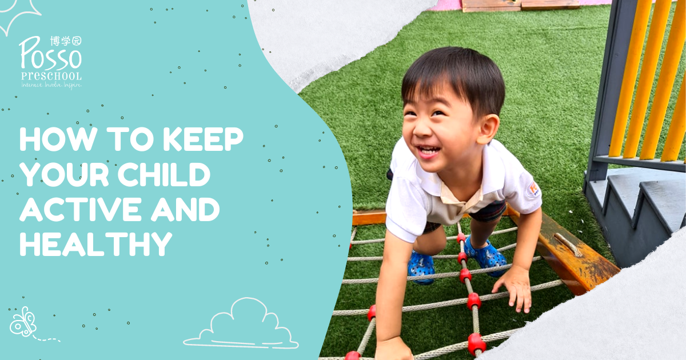

Keeping preschoolers active and healthy can be a challenge, especially in today's world where screens and sedentary activities are so prevalent. However, it's crucial to make sure your little one is getting enough exercise and healthy habits early on to set them up for a lifetime of health and wellness. Here are some ideas to keep your preschooler active and healthy:

**Outdoor Play**

Take your preschooler outside to play! Encourage them to run, jump, climb, and explore. Outdoor play is not only fun but also essential for developing gross motor skills and improving overall physical health. Take them to a park or playground or simply let them run around in the backyard.

**Active Games**

Preschoolers love games, and there are plenty of active games that you can play together. Simple games like tag, hide and seek, and hopscotch are great for getting kids moving. You can also try more structured games like Simon Says, Duck Duck Goose, or Red Light, Green Light.

**Dance Party**

Put on some music and have a dance party with your preschooler. Dancing is a fun way to get the heart pumping and improve coordination. Encourage your little one to come up with their own dance moves or try to copy yours.

**Yoga**

Yoga is a great activity for preschoolers as it promotes strength, flexibility, and mindfulness. There are plenty of kid-friendly yoga videos available online or consider taking a family yoga class together.

**Sports**

Introduce your preschooler to different sports and let them pick which ones they enjoy. Soccer, basketball, and gymnastics are all great options for young children. Not only do sports improve physical health, but they also teach important life skills like teamwork and sportsmanship.

**Limit Screen Time**

While screens can be a useful tool for education and entertainment, it's essential to limit your preschooler's screen time. The American Academy of Pediatrics recommends no more than one hour of screen time per day for children aged 2 to 5 years old. Instead, encourage your little one to engage in more active and imaginative play.

**Healthy Eating Habits**

In addition to physical activity, healthy eating habits are also crucial for preschoolers. Make sure your child is eating a variety of fruits, vegetables, whole grains, and lean proteins. Limit sugary and processed foods and encourage water and milk as the primary beverages.

In conclusion, there are plenty of ideas to keep your preschooler active and healthy. By promoting physical activity and healthy habits early on, you are setting your child up for a lifetime of health and wellness. Remember to have fun and be creative with your little one!