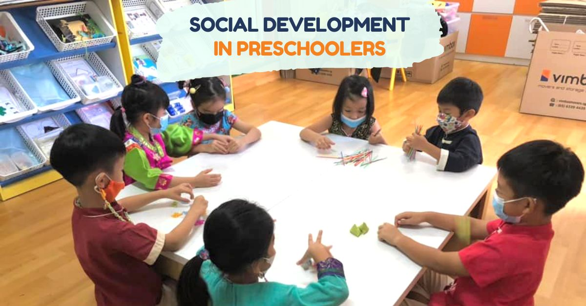

During your child's preschool-age years, they will learn a lot about themselves and how to interact with others during this time. Your child will become much less self-centered once they turn three years old. Furthermore, they will depend less on you, a sign that their sense of identity is more strong and secure. Instead of just playing alongside one another, they will now interact while playing with other kids. They will come to understand that not everyone thinks the same way they do and that each of their playmates has a variety of distinctive qualities, some of which are attractive and others which are not.

You'll notice that your child is gravitating toward particular kids and forming friendships with them. Children learn that they too have unique qualities that make them likeable as they develop these friendships, which is a crucial boost to self-esteem.

More good news regarding your child's growth at this stage: When playing with their friends, they will eventually stop competing and learn to work together as they become more conscious of and sensitive to the feelings and actions of others.

**Learning to cooperate**

Particularly in the beginning, you'll need to encourage this cooperation. For instance, you might advise them to "use their words" as opposed to acting out when dealing with issues. Additionally, remind them that each gets an equal turn when two kids are sharing a toy. When your child and another child want the same toy, suggest simple solutions such as drawing for the first turn or finding another toy or activity.

Although it may or may not work, it's worth a shot. Also, help children with the appropriate words to describe their feelings and desires so that they don't feel frustrated. Above all, lead by example and demonstrate how to resolve disputes amicably. Try to control your reactions around them if you have a quick temper. Otherwise, whenever they are stressed, they will behave like you.

**When anger or frustration gets physical**

No matter what you do, your child's anger or frustration will probably occasionally manifest itself physically. When that occurs, keep them from hurting other people, and if they don't settle down right away, remove them from the vicinity of the other kids. Discuss their feelings with them and try to figure out why they're so upset. The best way to express these emotions is not by physically attacking another child, so be sure to let them know you understand and accept her feelings.

**Saying sorry**

Remind them of a time when someone hit or yelled at them in order to help them understand the situation from the perspective of the other child, and then suggest more peaceful ways to settle their disputes. Finally, ask them to apologise to the other child once they have realised what they have done wrong—not before. However, just saying "I'm sorry" won't necessarily help your child change their behaviour; they also need to understand why they're making the apology. They might not comprehend right away, but give it some time; by the time they are four, these explanations will start to make sense.

**Make-believe play**

Fortunately, three-year-olds' typical interests prevent most fights from occurring. They spend a large portion of their playtime engaging in imaginative play, which is typically more cooperative than play that is centred on toys or games. Preschoolers enjoy dividing up the roles in elaborate pretend games using household or imaginary objects, as you've probably already noticed. Important social skills like taking turns, paying attention, communicating (through actions and expressions as well as words), and reacting to one another's actions are all developed through this kind of play. There is yet another advantage: Pretend play helps kids explore more sophisticated social concepts because it enables them to assume any role they like, such as superheroes or the fairy godmother. Additionally, it enhances executive functioning, including problem-solving.

You might notice your child starting to identify their own gender and gender identity by observing the role-playing in their pretend play. While playing house, boys naturally will adopt the father's role and girls the mother's, reflecting whatever they've noticed in the hemworld around them.

**Play sessions: helping your child make friends**

Your child should have a thriving social life by the age of four, with friends, and perhaps even a "best friend." They should have regular contact with friends from preschool and the neighbourhood. But what if your child doesn't attend preschool and doesn't live close to other kids his or her age? You might schedule play dates with other preschoolers in these circumstances. Parks, playgrounds, and preschool activity programmes all offer great chances for kids to interact with one another.

Additionally, it's critical to understand that your child's friends at this age go beyond simple playmates. They also directly affect how they think and act. Even when they violate the laws and moral codes you've taught them since they were babies, they will fervently want to be like them. They now understand that there are other values and viewpoints than your own, and they may put this new understanding to the test by requesting things you have never given him—certain toys, foods, clothing, or permission to watch particular TV shows.

**Testing limits**

If your child develops strong friendships with other kids, don't be discouraged if your relationship with them changes significantly. For the first time in their lives, they might treat you badly. Even though it may be difficult to accept, this snarkiness is a sign that they are developing the confidence to question authority and exercise their independence. Once more, handle it by expressing disapproval and possibly having a conversation with them to find out what they truly believe or feel. If you respond emotionally, you'll encourage bad behaviour to continue.

Remember that even though your child is learning about right and wrong, they still have a very basic understanding of morality. When people strictly follow the rules, it's probably not because they understand them; rather, it's because they want to avoid getting in trouble. They believe that outcomes matter more than intentions. Even if they didn't intentionally break something, they'll probably assume they are bad when they damage something of value. They must be taught the distinction between misbehaviour and accidents.

**Separate the child from their behaviour**

You must keep them apart from their behaviour in order to teach them this distinction. Make sure they understand they are being punished for the act, not because they are "bad," when they do or say something that requires punishment. Indicate precisely what they did incorrectly while keeping person and behaviour distinct. Explain why it is wrong if they are picking on a younger sibling rather than merely calling them out. When they unintentionally commit a wrong, console them and explain that you understand it was an error. Avoid getting angry, or they'll assume you're upset with them rather than what they did.

Giving your child tasks that you know they can complete and rewarding them when they succeed is also fundamental. They are capable of performing simple tasks like setting the table or cleaning their room. Explain to your children that you expect them to behave well on family outings, and give them praise when they do. Give them plenty of chances to play with other kids in addition to their responsibilities, and express your pride in them when they share or assist another kid.

**Sibling relationships**

The relationship with older siblings can be particularly difficult, especially if they are three to four years older. This is an important point to remember. Your four-year-old will frequently want to participate in all of their older sibling's activities, but your older child will frequently object to the interference. They might object to the invasion of their personal space, friendships, faster pace, and especially their possessions. You frequently end up mediating these disputes. It's crucial to look for a middle ground. Give your older child their own space, time, and independence while also encouraging cooperative play that is age-appropriate. Family holidays and outings are great opportunities to strengthen the good aspects of their relationship while also giving everyone their own activity and special time.