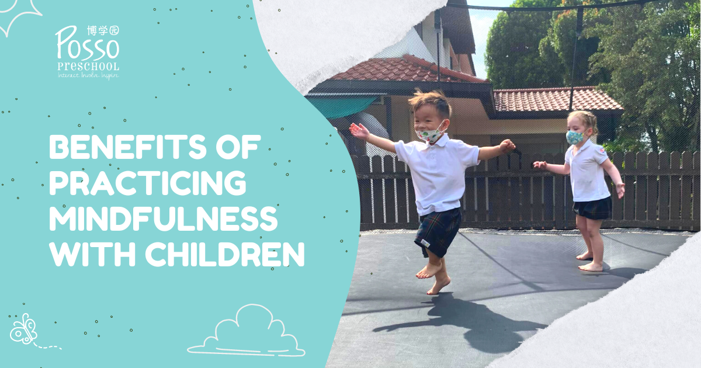

As parents and caregivers, we all want to provide the best possible start in life for our children. One way to support their emotional and mental well-being is through the practice of mindfulness. Mindfulness is the act of being present and fully engaged in the current moment, without judgement. It is a skill that can be taught to children from a very young age, and research has shown that it can provide numerous benefits. In this blog post, we will discuss 5 benefits of practicing mindfulness with preschoolers.

**Improved Self-Regulation**

Self-regulation refers to the ability to manage our emotions and behaviour in response to different situations. This is a crucial skill for children to develop as it helps them to navigate social interactions and cope with stress. Mindfulness can help children to develop self-regulation by teaching them to be aware of their thoughts and feelings without reacting to them. By learning to pause and observe their internal state, children can develop the ability to respond to situations in a more calm and thoughtful way.

**Increased Focus and Attention**

Children are naturally curious and love to explore the world around them. However, their attention span can be limited, and they can easily become distracted. Mindfulness practices, such as guided meditation, can help to improve focus and attention. By training the mind to stay present and focused on a specific task or object, children can develop the ability to concentrate for longer periods.

**Reduced Anxiety and Stress**

Anxiety and stress are common among children, particularly when faced with new situations or changes to their routine. Mindfulness can be an effective tool for reducing anxiety and stress by teaching children to focus on the present moment and let go of worries about the future or past. Mindful breathing exercises, for example, can help to calm the nervous system and promote relaxation.

**Improved Social Skills**

Mindfulness can also help children to develop important social skills, such as empathy, kindness and compassion. By learning to be present and fully engaged in social interactions, children can develop a greater sense of connection with others. Mindful listening exercises, for example, can help children to understand and appreciate the perspectives of others.

**Enhanced Well-being**

Finally, practicing mindfulness can promote overall well-being for children. By learning to focus on the present moment and develop a positive attitude towards themselves and others, children can develop a greater sense of happiness and contentment. Mindfulness practices can also help to improve sleep quality and reduce the risk of behavioural problems.

In conclusion, mindfulness is a valuable tool for promoting emotional and mental well-being in children. By teaching children to be present and fully engaged in the current moment, without judgement, we can help them to develop important skills that will serve them well throughout their lives.