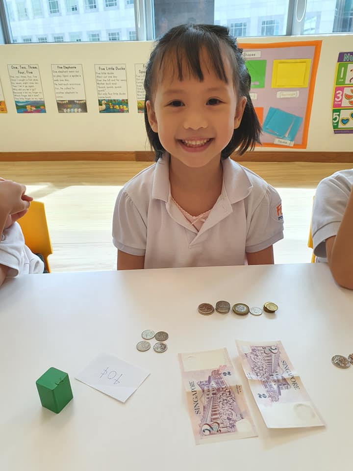

Many families are feeling the strain of a tough economy now more than ever. It is paramount that everyone in the family understands the value of money because every penny counts. While kids under 5 years old are unable to comprehend more advanced concepts of money, there are ways to start small and introduce financial literacy for them at an early age.

## Meaning of Financial Literacy

‘Financial literacy’ sounds complicated – but what exactly does it mean? At the core, financial literacy is a set of skills that enables people to make wise financial decisions. Being financially literate implies you understand how to make, save, spend (including donating), and invest money. Starting with the basics of money management might mean helping the young ones how to earn money and make small decisions with how to manage it.

## Importance of Financial Literacy for Kids

Teaching children about money at a young age instils positive financial habits that will follow them into adulthood. It is essential to have these types of conversations and to allow them to ask questions so that they can eventually contribute to their own financial success.

## Financial Literacy Activities for Kids

Experience is the key to raising financially-wise children, and they can obtain experience through educational activities. Here are some activities that will help your children learn about money in a fun, engaging, and age-appropriate manner.

*   **For children as young as 4 or 5, teach them the numerical value of coins** Allow children to hold the coins and compare their sizes, colours, and weights. From there, have them engage in an activity that allows them to combine currencies to reach specific amounts (2 of 50 cents make $1).
    

*   **Engage in dramatic play** Set up a pretend local supermarket or pizza shop and have children practice purchasing items and working different jobs.
    

*   **Assign values to items and test it through play** Price a variety of things throughout your house and ask children to pay for each one in different ways (using only 20 cents or only 50 cents, for example).
    

*   **Teach children about “needs” vs. “wants.”** Have your child create a list of things they need and a list of things they want. Young kids may enjoy cutting pictures from magazines to craft their lists. Create a game out of it! Then, use practical examples to compare and contrast the two notions. Make a list of the essentials they will need to survive (food, water, shelter, and clothing) vs the luxuries they want to have (toys, candy, or video games).
    

## Kids’ Money Making Ideas

Whether or not you are a believer in rewarding kids with money for doing household chores, there are plenty of other ways that children can earn an income for themselves.

*   Allow your children to assist you with tasks that you or a neighbour may pay someone else to do, such as feeding/walking pets or watering plants.
    

*   Instead of giving toys for birthdays, encourage your family and friends to give your children money instead. They can keep this money in a physical piggy bank or passport savings account.
    

*   Plan a flea market sale. Sort through old toys with your children and decide what you might be able to sell.
    

## Raising Finance-Wise Kids

Conversations about money may feel uncomfortable at first, but breaking the ice with your children early on can help assure financially literate individuals who feel empowered to ask questions and make wise financial decisions.