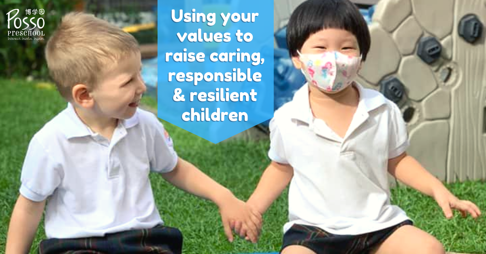

Values are extremely important in parenting since they profoundly influence all behaviours and attitudes, as well as our decisions and relationships. To fully embrace a value, you must act on it and your behaviour must reflect it - not merely verbally accept it or believe that you should follow it.

The following common sayings allude to the critical principle of acting in accordance with your values in order to maintain internal integrity:

*   put your money where your mouth is;
    
*   walk the walk not just talk the talk;
    
*   actions speak louder than words;
    
*   children do as they see, not do as they are told to do.
    

## Facts about values

#### Values Can Cause Conflict

A person's sense of responsibility for another person grows as their relationship with that person grows closer. That explains why parents frequently have a strong desire to ensure that their children embrace and act in accordance with their standards.

Values, especially opinions on how to parent, are profoundly personal and typically held with tremendous conviction. People who are deeply committed to their principles may feel personally assaulted when someone disagrees with them or attempts to impose their values on them. As a result, disputes can arise when one person tries to instruct another how to raise his children.

Young parents, for example, are typically quite sensitive to criticisms and suggestions about their parenting choices from their own parents, as it often feels like criticism of a value the newer parents believe.

#### Values Are Subjective

Often values are not consciously chosen. They are founded on deep beliefs that people learn from their parents when they are so young that they believe whatever their parents say and do without question.

These early views are largely taught to children nonverbally and through the numerous interactions they have with their parents during their upbringing. Children typically adopt the values of people in authority until they are mature enough (and encouraged) to think for themselves.

Values are purely subjective and represent personal opinions rather than facts. People frequently believe that what they value is a commonly accepted opinion that is both factual and objective.

When opinions, which are defined by our values and are interpretations of facts, are stated as facts and considered to be facts, prejudices are formed. These are therefore frequently conveyed to children as absolute truths.

A parent, for example, may encourage a child's studiousness and seriousness while communicating to a more noisy child that his very active temperament is 'bad.' This highly active child may grow up believing that something is wrong with him.

#### The Values About Values

Understanding the concept of values and the significance of imparting them to their children provides parents with a powerful tool for influencing their children and shielding them from the negative forces in the outer world.

Parents are not helpless in the face of cultural and media realities that challenge their belief systems and make practising healthy parenting feel like an exercise in "swimming upstream."

#### Values Provide Clarity

When parents understand what they value for themselves and how those values influence what they want for their children, they are more effective and clear.

The more aware parents are of the values they want to instil in their children, and the more they know about effective methods of doing so, the more probable it is that their children will acquire and assimilate those values.

#### Values Provide Guidance

Knowing your child's goals can help you decide how to interact with them. It helps you focus your parenting decisions, direct your children, identify what messages you want to send, and reinforce what behaviours and attitudes you want to promote. Do you wish to emphasise:

*   hard work?
    
*   kindness?
    
*   generosity?
    
*   assertiveness?
    
*   independence?
    

It helps you pick your battles, decide what is worth your time and attention, and what you can let go of.

#### Values Impact Relationships

Understanding your values might help you identify when one value contradicts another. You can then decide what your priorities are in relation to the two competing values. Do you value:

*   honesty or politeness?
    
*   neatness or creativity?
    
*   socialization time with peers or time with family?
    

Knowing what you value might help you decide when and how to intervene in a situation involving your children. If you witness your child misbehaving in a way that contradicts a value you wish to inculcate, it can be a sign that the child needs to learn something, whether it's kindness, generosity, responsibility, honesty, or anything else.

Rather than being a reason to be angry and punish, the situation might be a chance to perform your job as a parent and teach that value and the behaviours that reflect it.